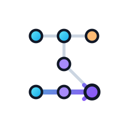

# skeleton

[](https://github.com/ml-affairs/skeleton/actions/workflows/ci.yml)


Skeleton is a developer-understanding tool, not a profiler. It runs a Python
script under a lightweight runtime tracer and turns the observed execution into
an interactive, replayable architecture map.

Core promise:

> Replay and visualise the living architecture of a Python application.

Skeleton produces runtime evidence in four complementary forms:

| Surface | Purpose |
| --- | --- |
|  `trace.jsonl` | Ordered public call and return events. |
|  `snapshot.json` | Graph-shaped modules, classes, functions, instances, and edges. |
|  `workflow.md` | LLM-readable workflow evidence with stable event and node references. |
|  `report.html` | Interactive visual replay for humans. |

## MVP workflow

```bash
python -m skeleton run path/to/script.py
```

Skeleton writes:

```text
~/.skeleton/<application-name>/
  trace.jsonl
  snapshot.json
  workflow.md
  report.html
```

The first version is intentionally non-invasive. You do not add decorators or
modify application code. The runner wraps an existing script, traces only
project-local public functions and methods by default, and records safe
summaries of arguments and return values.

Skeleton is opinionated about what makes large Python systems understandable.
It promotes explicit architectural actors, clear dependency direction, and I/O
decoupled from business logic. Modules are visual shells, runtime object
instances live inside the modules that define their classes, module-level public
functions live inside their modules, and instance methods live inside the object
that handled the call. Class definitions remain metadata, not runtime graph
boxes. Entrypoints, services, repositories, adapters, and ports are roles or
boundaries unless the codebase has a concrete object that owns that
responsibility. See
[`docs/design/software-design-principles.md`](docs/design/software-design-principles.md)
for the design principles that guide the visual model.

`workflow.md` is a compact text explanation of the observed run. It is designed
for humans and LLMs: event ids, node ids, caller/callee relationships, safe
examples, and known trace gaps are written in a form that can be quoted and
reasoned over without scraping the HTML report.

## Install and develop

```bash
make setup
make check
```

Use `make test` for normal or targeted local pytest runs. Use `make test-cov`
or `make check` when you want the full-suite coverage gate that CI enforces.

Print the local artifact locations:

```bash
make where
```

Run locally from the checkout:

```bash
uv run python -m skeleton run examples/app.py
```

Generate a stable local demo report:

```bash
make demo
```

The demo writes artifacts to `tests/dev/.temp/skeleton-demo/` and opens
`report.html` in your default browser. For a headless run that writes the same
files without opening a browser, use:

```bash
make demo-no-open
```

Pytest tests use `tmp_path`, so test-generated reports live in pytest-managed
temporary directories under `tests/dev/.temp/pytest/`. The stable report to open
while developing the UI is:

```text
tests/dev/.temp/skeleton-demo/report.html
```

Regenerate it with:

```bash
make demo-no-open
```

## CLI

```bash
python -m skeleton run [options] path/to/script.py [args...]
```

Options:

```text
--project-root PATH   Root used to decide which files are project-local.
--out-dir PATH        Output directory. Defaults to ~/.skeleton/<application-name>.
--include PATTERN     Only trace matching relative paths or module names.
--exclude PATTERN     Exclude matching relative paths or module names.
--max-events N        Stop writing trace events after N events.
--no-html             Skip report.html generation and opening.
--no-open             Do not open report.html after generation.
```

Output location precedence:

1. `--out-dir PATH`
2. `SKELETON_OUT_DIR`
3. `SKELETON_HOME/<application-name>`
4. `~/.skeleton/<application-name>`

When HTML generation is enabled, Skeleton opens `report.html` in your default
browser at the end of the run. Use `--no-open` for CI, scripts, or headless
environments.

## What gets traced

Skeleton uses `sys.setprofile` and records Python `call` and `return` events
when all of these are true:

- The frame's file is under the project root.
- The file is not in ignored local infrastructure such as `.venv`, `.git`, or
  `.skeleton`.
- The callable name is public. Names beginning with `_` are ignored.

The trace identifies the module, class where practical, function or method,
caller, callee, instance identity where practical, call depth, event order,
timestamp, safe argument summaries, and safe return summaries.

## How it works

Skeleton does not patch your source code. It uses Python's own runtime
introspection:

- `runpy.run_path()` runs the target script as `__main__` inside a controlled
  runner.
- `sys.setprofile()` receives callbacks whenever Python enters or returns from a
  function.
- Each callback receives a frame object. From that frame Skeleton reads
  `frame.f_code`, `frame.f_globals`, and `frame.f_locals` to identify the file,
  module, function name, line number, arguments, and whether the call has
  `self`.
- When `self` is present, Skeleton records `type(self).__name__` and
  `id(self)`, giving a run-local object identity such as
  `service.Greeter@0x...`.
- Values are summarized immediately, then the raw objects are discarded.

That is why the report can show instance-owned methods without decorators. It is
not reading class source to guess behavior; it is watching Python call real
functions on real objects. The object ids are only meaningful within one run,
not across processes or commits.

For more detail, see
[`docs/design/runtime-introspection.md`](docs/design/runtime-introspection.md).

## Event schema

Each line in `.skeleton/trace.jsonl` is a JSON object:

```json
{
  "schema_version": 1,
  "event_type": "call",
  "order": 0,
  "timestamp": 1782740000.0,
  "depth": 0,
  "caller": null,
  "callee": {
    "module": "app",
    "class_name": null,
    "function": "main",
    "qualified_name": "app.main",
    "file": "/project/app.py",
    "line": 10,
    "node_id": "function:app.main",
    "instance_id": null
  },
  "args": {}
}
```

Return events use the same endpoint shape and include `return_value`.

## Safety model

Skeleton records summaries, not full object contents.

- Strings are truncated.
- Containers include type, length, and a small preview.
- Objects include only class name and object id.
- Argument or mapping names containing `password`, `token`, `secret`, `key`,
  `auth`, or `credential` are redacted.

This is not a debugger replacement and not a performance profiler. It is a
runtime architecture replay tool for understanding how a codebase behaves.
