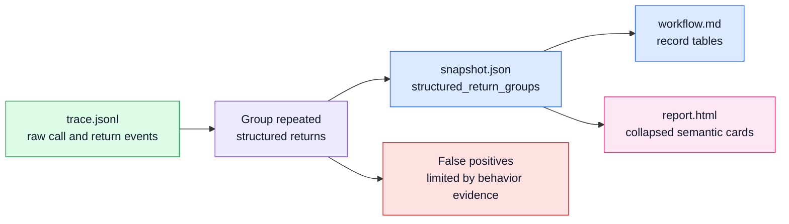

# Structured Return Aggregation

## Status

Accepted

## Diagram

## Context

Skeleton preserves raw runtime call and return events in `trace.jsonl`. That is
the right fidelity boundary, but repeated low-complexity calls that return small
dict-like records can dominate the report graph and workflow narrative. A user
then has to inspect repeated JSON previews to discover that the run simply
materialized a catalog or manifest.

The common pattern is generic:

- the same callable returns multiple structured records
- return summaries expose compatible dictionary keys
- values are mostly scalar summaries
- records contain semantic fields such as `name`, `id`, `kind`, `lane`, `owner`,
  `role`, `stage`, `event_type`, or `active`
- the call has low observed behavior complexity

Names such as `payload`, `to_dict`, or `metadata` can be weak hints, but they are
not enough to decide that behavior is only presentation metadata.

## Decision

Skeleton will derive `structured_return_groups` in `snapshot.json` from the raw
event stream after trace events are read. `trace.jsonl` remains unchanged and
complete.

The analyzer groups repeated structured returns by observed event evidence:
compatible safe dictionary previews, key overlap, mostly scalar values, minimum
record count, semantic fields, and no observed child/resource calls. Optional
project configuration in `pyproject.toml` can tune thresholds, labels, and row
display fields without requiring decorators or application-code changes.

The workflow narrative, HTML report, and trace-window export consume the derived
snapshot artifact rather than rediscovering groups ad hoc. The HTML report can
collapse grouped calls visually by default, render records as a concise table,
and still expose raw event details.

## Consequences

This improves report readability for catalog and manifest materialization while
preserving raw evidence for debugging, replay, and LLM review.

The snapshot now contains an additive derived presentation artifact. It is not a
replacement for raw events and should be treated as provisional semantic output
while Skeleton is pre-stable.

False positives are limited by requiring repeated compatible records and low
observed behavior complexity. A method named `payload()` that performs real
workflow work remains visible in the primary graph when it has child calls or
resource events.
