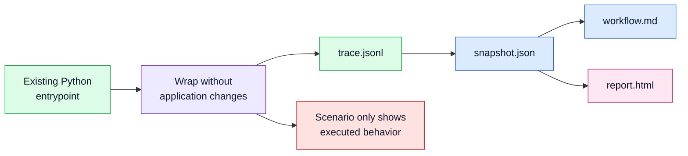

# Non-Invasive Runtime Replay

## Status

Accepted

## Diagram



## Context

Skeleton's first product boundary is the runner seam. The tool needs to explain
real Python behavior without asking users to add decorators, SDK calls, or
application-code instrumentation. Static source facts are useful context, but
they cannot prove which objects collaborated, which calls happened, or which
values crossed a boundary during one scenario.

The initial package shipped a CLI, Python API, runtime trace, snapshot,
workflow narrative, and HTML report around this premise.

## Decision

Skeleton runs existing Python entrypoints under a standard-library runtime
profile hook and records project-local call and return events. The target code
remains unchanged.

The runtime event stream is the source of truth for scenario behavior. Static
analysis may enrich the snapshot with file, symbol, or size context, but it
does not decide that a relationship happened.

The generated artifact sequence is:

```text
run -> trace.jsonl -> snapshot.json -> workflow.md -> report.html
```

## Consequences

Users can try Skeleton against existing scripts and scenarios without adopting a
framework or modifying source.

Skeleton remains an architecture replay tool rather than a profiler, debugger,
or tracing vendor SDK. The product can miss behavior that the selected scenario
does not exercise, and must be honest about that limitation.

The runtime package can stay dependency-light because the core tracing seam uses
Python's standard library.
