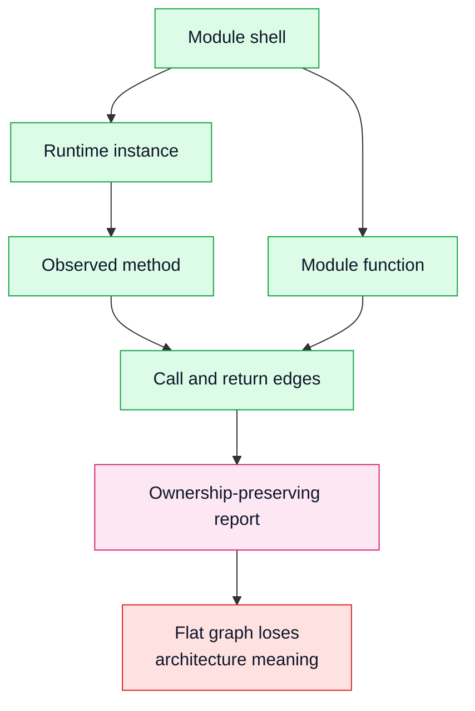

# Runtime Ownership Report Model

## Status

Accepted

## Diagram

## Context

Early graph output can become visually impressive but semantically vague if
every file, class, function, method, and instance is rendered as an equal node.
Skeleton's report is meant to teach maintainable Python architecture, so it must
preserve ownership and runtime actor boundaries.

The design docs establish the product model: modules are ownership shells,
runtime instances are actors, public functions and methods are observed
behavior, and class definitions are metadata unless a future feature explicitly
models class objects as runtime actors.

## Decision

The report presents a runtime ownership model:

- modules and packages are outer shells
- runtime object instances live inside the module that defines their class
- observed public instance methods live inside the runtime instance that handled
  the call
- module-level public functions live inside their module
- call and return edges connect observed public behavior
- private/internal calls remain evidence, but are marked as internal and can be
  hidden from the public-interface view

Replay is evidence-progressive. At a given replay position, the visible graph
should reflect what has been observed up to that event, not the final snapshot
as if it existed from time zero.

## Consequences

Users can see which concrete object handled a method call and which module owns
that object. This prevents class definitions, helper functions, and runtime
instances from competing as unrelated peers.

The snapshot may contain lower-level metadata, but the HTML report applies an
opinionated projection over it. Report tests should protect conceptual
rendering rules, not just file generation.

Future query and IDE integrations should preserve this ownership model when
linking report nodes back to source.
