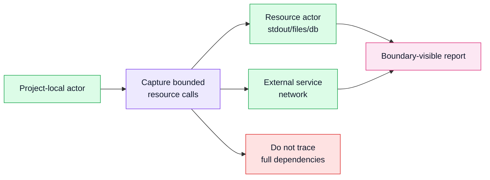

# Runtime Resource Boundary Evidence

## Status

Accepted

## Diagram

## Context

Important architecture behavior often crosses out of Python project-local
frames: stdout, filesystem access, SQLite, network sockets, queues, caches,
clocks, random sources, and model providers. If those operations are hidden
inside ordinary call edges, the report cannot show where I/O enters a workflow
or whether business logic is coupled directly to infrastructure.

At the same time, tracing the whole standard library or third-party stack would
turn Skeleton into a noisy dependency trace.

## Decision

Skeleton records a small allow-list of runtime resource boundary events only
while project-local code is active on the trace stack.

The snapshot and report project these as explicit resource or external-service
actors rather than burying them inside method labels. Current resource evidence
includes stdout, filesystem operations, SQLite/database operations, and basic
network socket calls.

External network endpoints are modeled as external services. Local resources
such as stdout, filesystems, and databases are modeled as resources.

## Consequences

The report can show hidden I/O and boundary crossings without pulling the full
dependency graph into the architecture view.

Resource evidence remains bounded and conservative. Adding a new resource kind
requires a clear product reason, tests, safe value summaries, and documentation
of what is captured.

This supports quality signals and future query features such as "which actors
touched external resources in this scenario?"
