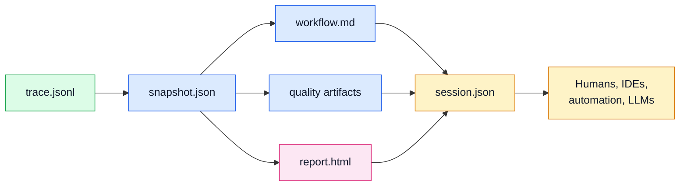

# Evidence Workbench Artifacts

## Status

Accepted

## Diagram

## Context

Skeleton's output needs to serve three audiences:

- humans stepping through an interactive report
- developers reading concise workflow and quality explanations
- automation or LLM tools consuming structured evidence

An HTML-only report would be hard for tools to consume, while raw JSON-only
output would lose the interactive replay value.

## Decision

Skeleton emits complementary artifacts for each run:

- `trace.jsonl` for ordered raw runtime events
- `snapshot.json` for graph-shaped derived evidence
- `workflow.md` for LLM-readable workflow narration
- `quality.json` and `architecture_quality.md` for design-quality signals
- `report.html` for the interactive architecture workbench

The report uses time-aware replay controls, selected trace windows, current
event explanations, actor metadata, and visual overlays. Metrics such as
fan-in, fan-out, call count, edge width, node size, first seen, and last seen
should respect the current replay window.

Trace-window exports include exact events, related nodes and edges, quality
evidence, and LLM-readable notes.

## Consequences

Skeleton can support visual inspection, code review, debugging, and assistant
workflows from the same run without making any single artifact carry every use
case.

The artifact pipeline must remain coherent: changes to snapshot shape, workflow
narration, quality signals, or report behavior should preserve traceability back
to raw event ids and node ids.

The HTML report is the primary human workbench, but machine integrations should
prefer structured artifacts over scraping report markup.
