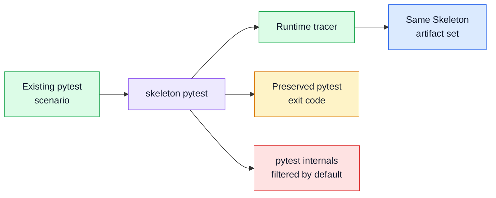

# Pytest Scenario Tracing

## Status

Accepted

## Diagram

## Context

Many Python projects already encode meaningful workflows as tests. Requiring
users to create wrapper scripts for every scenario adds friction and undermines
Skeleton's non-invasive workflow.

The package still needs to keep pytest optional for users who only trace normal
scripts.

## Decision

Skeleton provides `skeleton pytest` and `TraceSession.run_pytest()` as first
class runner seams. They run pytest in-process under the same runtime tracer,
preserve pytest's exit code, and emit the same trace, snapshot, workflow,
quality, and report artifacts as script runs.

Pytest imports are delayed until the pytest runner is used, so script-only users
do not get a hard pytest runtime dependency.

If pytest fails before tracing starts, Skeleton still writes an empty
`trace.jsonl` plus derived artifacts where possible so the command has a
consistent output contract.

## Consequences

Users can replay architecture through existing tests without decorators or test
suite hooks.

Test harness actors may appear in evidence, so the report needs derived
presentation roles to distinguish scenario setup and test utilities from the
system under inspection.

Future pytest-native plugin hooks may build on this seam, but the current
Skeleton-owned CLI command remains the supported v0 integration.
