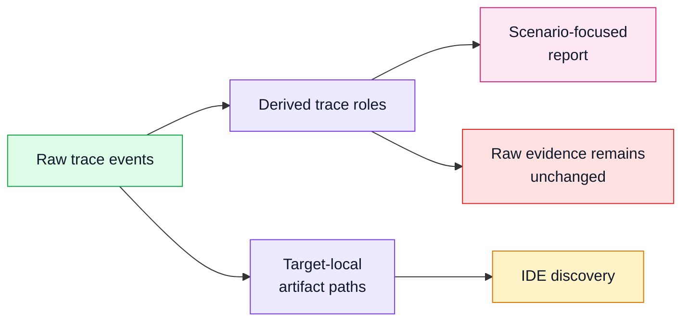

# Trace Roles And Artifact Placement

## Status

Accepted

## Diagram

## Context

Scenario traces often include setup, import-time work, test harness calls, test
utilities, and roots whose caller is outside the selected trace boundary. These
events are real evidence and should remain in raw artifacts, but they should not
visually compete with the main application workflow.

Output directories also need predictable defaults. A global default such as
`~/.skeleton/<application>` is useful, but it is less discoverable than
target-local artifacts when users right-click scripts or tests in an IDE.

## Decision

Skeleton derives trace roles in `snapshot.json` without changing raw
`trace.jsonl` events. Current roles include entrypoint, system under test, test
harness, test utility, import setup, and filtered external roots.

The report uses those roles to start replay at the inferred scenario entrypoint
when possible, group setup-before-entrypoint evidence, and render harness/setup
frames with lower visual weight.

Default artifact placement is target-local and collision-aware:

- `skeleton run path/to/scenario.py` writes under
  `path/to/.skeleton/scenario/latest/`
- `skeleton pytest -- tests/foo/test_bar.py::test_x` writes under a
  deterministic selected-test path
- explicit `--out-dir`, `SKELETON_OUT_DIR`, and `SKELETON_HOME` still take
  precedence

## Consequences

Raw evidence is preserved while the report emphasizes the main workflow.

Target-local defaults improve first-run ergonomics, IDE integration, and
artifact discovery. Callers that need stable custom locations can continue to
use explicit output settings.

Role derivation and path resolution are presentation/integration contracts and
need focused tests because they shape how users find and interpret runs.
