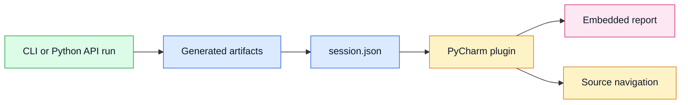

# Session Manifest For IDE Integration

## Status

Accepted

## Diagram

## Context

Skeleton is now intended to support an embedded PyCharm workbench while
remaining a PyPI library. The IDE plugin should not reimplement tracing, guess
artifact paths from CLI text, or depend on internal Python object graphs.

The plugin needs a stable, compact handoff artifact after each run.

## Decision

Every CLI and Python API run writes `session.json` beside the other artifacts.
The manifest records:

- schema version
- Skeleton package version
- command and reproducible invocation
- project root
- traced target
- paths to trace, snapshot, workflow, quality, report, and session artifacts
- event, node, and edge metrics
- target exit code
- target error when present
- whether the report was opened

The plugin and other automation should read `session.json` first, then load the
linked artifacts.

## Consequences

Skeleton can continue shipping the engine through PyPI while IDEs consume a
small integration contract.

The manifest is additive and does not replace existing artifacts. It should
remain stable enough for external tools while lower-level trace and snapshot
schemas continue to evolve during public alpha.

Future IDE features such as embedded report rendering, source navigation, and
project-tree synchronization should bridge from report selections through
manifest and snapshot evidence rather than CLI output.
