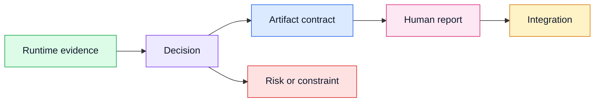

# Architecture Decision Records

Skeleton ADRs record durable decisions about runtime evidence, artifact
contracts, report semantics, integration seams, and package boundaries.

Each ADR should include a Mermaid diagram using this shared color palette:

Use the same class names and color codes across ADR diagrams so readers can scan
decisions consistently.
