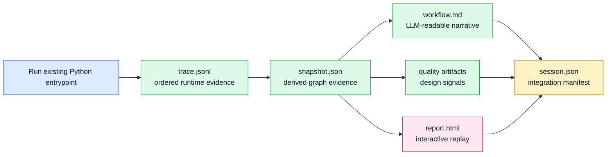

# Skeleton Design Principles

## Status

Accepted design doctrine.

## Product Thesis

Skeleton turns observed Python execution into replayable architecture evidence.
It is not a profiler, debugger, tracing SDK, or generic repository knowledge
graph. Its source of truth is what happened during one runtime scenario.

The durable pipeline is:



## Core Rules

Runtime evidence comes first. Static source facts can add context, but they do
not prove that a relationship happened. The report, workflow text, quality
signals, future query features, and IDE integrations should cite event, node,
edge, path, and safe-summary evidence rather than asking users or LLMs to infer
behavior from source alone.

Skeleton is non-invasive. Users should be able to run existing scripts and tests
without decorators or application-code changes. The runner wraps an entrypoint,
captures project-local execution, writes artifacts, and restores process state.

Skeleton represents architectural actors, not every implementation artifact as
an equal graph node. Modules are ownership shells. Runtime instances are actors.
Observed public functions and methods are behavior. Class definitions are type
metadata unless a future feature deliberately models class objects as runtime
actors.

Replay should be evidence-progressive. At event zero the report should show only
what has been observed. As users step forward, modules, instances, functions,
methods, calls, returns, and resources appear when runtime evidence first
mentions them. Stepping backward hides future evidence again.

## Runtime Introspection Model

Skeleton uses Python's standard-library runtime hooks rather than source
instrumentation. `sys.setprofile()` observes Python call and return events, plus
a small allow-list of C-level resource calls while project-local code is active.

For each frame, Skeleton reads a controlled set of metadata:

- file path
- module name
- function name
- first line number
- local variables needed to identify arguments and `self`

When `self` is present, Skeleton records a run-local instance identity such as
`service.Greeter@0x...`. That identity is meaningful within one process and one
run only. It is not a persistent object id.

Values are summarized immediately. Skeleton records safe summaries of
arguments and returns, not raw object contents.

## Ownership And Boundary Model

The report should preserve Python ownership:

- module or package as outer shell
- runtime object instance inside the defining module
- observed instance method inside the runtime instance
- observed module-level public function inside the module
- call and return edges between observed behavior

Roles such as entrypoint, service, repository, adapter, port, and external
resource should be attached to concrete runtime actors when evidence supports
that interpretation. They should not become graph nodes merely because a naming
convention suggests them.

I/O should be first-class boundary evidence. Databases, filesystems, stdout,
HTTP services, queues, caches, model providers, clocks, randomness, and
environment access should be visible as resources or external services when
observed, not hidden inside generic method-call edges.

## Artifact Responsibilities

Each artifact has a distinct job:

- `trace.jsonl`: raw ordered evidence; preserve fidelity
- `snapshot.json`: derived graph and presentation evidence
- `workflow.md`: compact human/LLM-readable explanation
- `quality.json`: machine-readable design signals
- `architecture_quality.md`: human-readable design review surface
- `report.html`: interactive replay workbench
- `session.json`: stable integration manifest for IDEs and automation

Do not make one artifact rediscover another artifact's decisions ad hoc. Shared
derived concepts should live in the snapshot or manifest and be consumed by the
workflow, report, exports, and integrations.

## Safety And Privacy

Skeleton should never dump live object contents. It should summarize:

- primitives in small form
- strings with truncation
- containers by type, length, and small preview
- objects by class name and run-local id
- likely secrets as redacted values

Resource and request integrations need stronger safety tests before they expand.
Any new capture surface must explain what is recorded, what is deliberately not
recorded, and how secrets are redacted.

## Human Replay And LLM Output

The HTML report is the primary human workbench: graph first, step-through
controls, current event details, actor metadata, selected trace windows, and
time-aware metrics.

`workflow.md` is the primary narrative artifact for humans and LLMs. It should
cite stable evidence: event ids, node ids, edge ids, caller/callee
relationships, safe input/output examples, and known trace gaps.

Future query features should operate on saved evidence first:

```text
skeleton query "which actors called PaymentGateway?"
skeleton path OrderService PaymentGateway
skeleton explain --event 42
skeleton compare run-a run-b
```

LLM interpretation can enrich answers later, but answers should remain grounded
in runtime evidence.

## Category Boundary

Skeleton can learn from static and multi-modal knowledge graph tools, but it
should not become one by default.

Static knowledge graph tools answer "what does this repository contain and
mean?" Skeleton answers "what happened in this execution?" Static context may
later enrich replay, but runtime evidence must determine which actors, calls,
values, returns, and resources appeared in a scenario.

Avoid:

- turning Tree-sitter or multi-language static parsing into the v0 core story
- sending source or runtime values to an LLM by default
- implying coverage for behavior that the scenario did not exercise
- rendering every repository concept as an equal graph node

## Development Implications

When adding or changing behavior:

- preserve raw trace fidelity unless the trace schema is intentionally changed
- put semantic grouping and presentation choices above raw trace capture where
  possible
- prefer owned objects for stateful behavior, policy, I/O, validation, and
  artifact generation
- keep public APIs small and intent-shaped
- document artifact contracts when external tools or users consume them
- add ADRs for durable product boundaries, runtime models, artifact contracts,
  integration seams, and report interpretation rules

