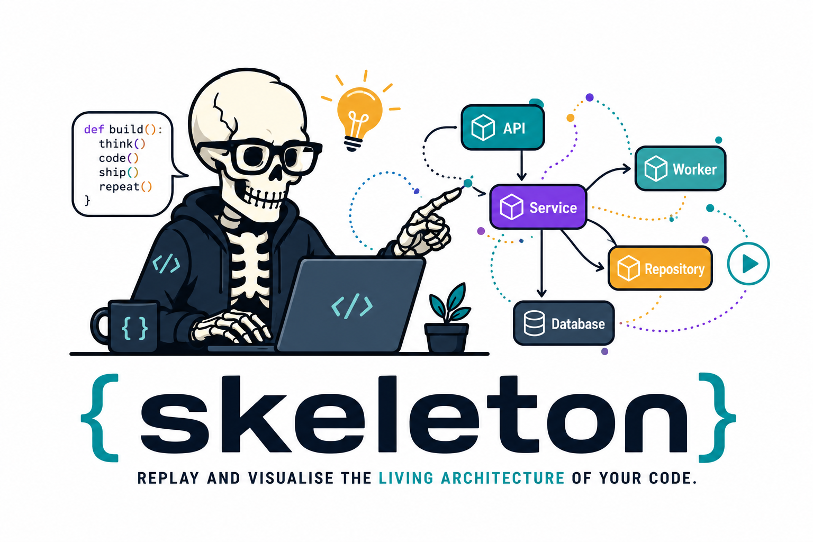

# Traceability Product Direction

## Status

Draft.

## Product Thesis

Skeleton should become known for turning Python execution into a replayable
understanding layer. The output is not just a call graph. It is evidence that can
be inspected visually by a human, stepped through as a timeline, and summarized
as structured workflow text that an LLM can use without inventing architecture.

This traceability layer is intentionally opinionated about maintainable Python
design. The default report should show architectural actors and boundary roles,
not every file and function as equal nodes. See
[`software-design-principles.md`](software-design-principles.md) for the design
patterns and visual rules Skeleton should preserve as it grows. See
[`runtime-introspection.md`](runtime-introspection.md) for the Python runtime
mechanisms that make the non-invasive runner possible.

## What Must Be True

- Human users can see modules, runtime instances, functions, methods, and
  runtime calls as an interactive map.
- Human users can step forward and backward through observed events and see the
  caller, callee, safe arguments, safe returns, and changed graph context.
- The same run produces machine-amenable text and JSON summaries that explain
  workflow order, actors, relationships, and observed examples.
- LLM-facing output must be evidence-shaped. It should cite event ids, node ids,
  edge ids, and safe summaries instead of asking the model to infer structure
  from source code alone.
- Future query interactions should be possible without reworking the schema.
  Cypher-like graph questions are a useful north star: "show calls from X to Y",
  "which instances mediate this workflow", "what public methods fan out from
  this actor", and "replay the path that produced this return value".

## Human Replay

The report should behave like an architecture workbench:

- graph first, not a static report page
- step-through controls tied to the runtime event stream
- progressive reveal: entities appear only when runtime evidence first observes
  them, and stepping backward hides future evidence again
- live metrics: fan-in, fan-out, call count, edge width, and node size reflect
  the current replay position
- selected node metadata with observed calls and examples
- edge emphasis based on call count and current replay position
- clear labels for modules, runtime instances, public functions, and methods

The graph is only useful when it remains explainable. Every visual element
should map back to a stable node id, edge id, file path, and event id.

## LLM-Readable Workflow Output

Skeleton should generate a compact workflow explanation alongside raw JSON:

- actors observed in this run
- ordered public calls
- caller/callee relationships
- safe input and output examples
- notable fan-in and fan-out points
- unresolved gaps, such as untraced private methods or excluded dependencies

This should be written as structured text or JSON that an LLM can quote and
reason over. The model should not need to scrape HTML or reverse-engineer graph
layout data.

## Query Direction

Cypher-like interactions are promising, but the first version should avoid
pretending to be a graph database. The schema should make later queries natural:

- stable ids for nodes, edges, events, modules, classes, functions, and instances
- explicit edge kinds
- first_seen and last_seen event order
- safe examples linked back to events
- enough metadata to filter by module, class, function, file, and depth

The eventual user experience could support natural language questions and a
small structured query language over the snapshot. That only works if v0 treats
trace and snapshot shape as real product contracts.

## Visual Language

The image set under `docs/images/` is part of the product direction:

- `readme.png` is the primary README and package-facing hero image.
- `icons.png` is the inspiration sheet for the concept vocabulary.
- `product/*.svg` contains first-party SVG icons derived from that direction for
  package-facing docs and future report surfaces.

Use these images where they explain the product model: CLI entry, trace capture,
snapshot graph, replay timeline, safety summaries, and LLM-readable workflow
evidence. Avoid sprinkling icons as decoration when they do not clarify the
architecture replay story.

## Pressure-Test Questions

- What is the smallest workflow explanation that is useful to an LLM but not
  bloated for a human?
- Which event fields are stable contracts, and which are implementation details?
- How do we prevent the graph from becoming visually impressive but semantically
  vague?
- Should private calls be completely absent, or summarized as hidden/internal
  spans so users understand gaps in the replay?
- What is the first query we want to make delightful: path replay, actor fan-out,
  instance lifecycle, or module collaboration?
- How will users compare two runs without confusing runtime behavior changes
  with source-code changes?
